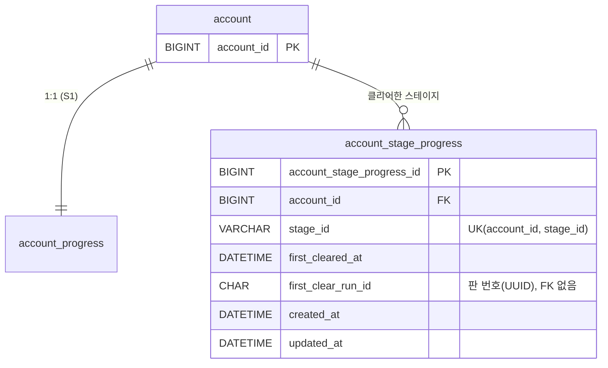

# ERD: 스테이지 진행

> 마이그레이션 `V4__create_account_stage_progress.sql` · 명세 루트 `docs/contracts/stage-api.md`(ST2 `GET /accounts/me/stages`가 이 표를 읽음) · 코드 `stage` 패키지

## account_stage_progress

계정이 클리어한 스테이지마다 한 행입니다. **행이 있으면 클리어한 것입니다.**

| 칼럼 | 타입 | 설명 |
|---|---|---|
| `account_stage_progress_id` | BIGINT, 자동 증가 | 행 번호 |
| `account_id` | BIGINT | `account.account_id`(외래 키) |
| `stage_id` | VARCHAR(64), 대소문자 구분 | `master/stages.json`의 스테이지 키 = UE `FName`. 영문 소문자·숫자·점(CHECK). 바꾸지 않습니다 |
| `first_cleared_at` | DATETIME(3), UTC | 서버가 처음 클리어 결과를 받아들인 시각. 재전송(판 유효 24시간)이면 플레이 시각보다 늦을 수 있습니다 |
| `first_clear_run_id` | CHAR(36), 대소문자 구분, 비어도 됨 | 처음 클리어한 판 번호(S2, UUID 소문자·하이픈 36자). S2 판 표의 판 번호와 같은 정의(`utf8mb4_0900_bin`)라 조인할 수 있습니다. 외래 키는 걸지 않습니다 |
| `created_at`·`updated_at` | DATETIME(3), UTC | 생성·수정 시각 |

| 제약 | 내용 |
|---|---|
| `uk_account_stage_progress_account_stage` | (계정, 스테이지) 한 행 |
| `fk_account_stage_progress_account` | 있는 계정만 |
| `ck_account_stage_progress_stage_id` | 키 모양 `^[a-z0-9.]{1,64}$` |
| `ck_account_stage_progress_run_id` | 판 번호 모양(소문자 UUID) |

## 규칙

- **열림·잠김은 표에 두지 않습니다.** 서버가 `stages.json`의 `requires`로 계산합니다. 클리어했으면 `CLEARED`, `requires`가 없거나 `requires`를 클리어했으면 `OPEN`, 그 밖은 `LOCKED`입니다. 그래서 새 계정·기존 계정·나중에 더한 스테이지에 따로 행을 넣을 필요가 없습니다.
- 행은 S2 결과 트랜잭션 안에서 넣기만 하고 고치지 않습니다(`StageProgressService.recordResult`). 실패한 판은 행을 만들지 않고, 다시 클리어해도 행은 그대로입니다.
- 같은 클리어가 동시에 와도 `INSERT … ON DUPLICATE KEY UPDATE`로 예외 없이 한 행입니다.
- 판 표에 외래 키가 없으므로, S2의 표와 어느 쪽이 먼저 병합되든 상관없습니다.

## 나중에 바뀔 것

| 때 | 바뀌는 것 |
|---|---|
| 난이도(M9) | `difficulty` 칼럼, 유일 제약 (계정, 스테이지, 난이도) — 새 마이그레이션 |
| 스테이지를 뺄 때 | 키를 지우지 않고 마스터 데이터에 숨김 칸. 서버는 마스터에 없는 키의 행을 건너뜁니다 |
| 클리어 횟수·최고 기록 | 이 표가 아니라 S2 결과 표에서 계산하는 쪽을 먼저 검토 |
