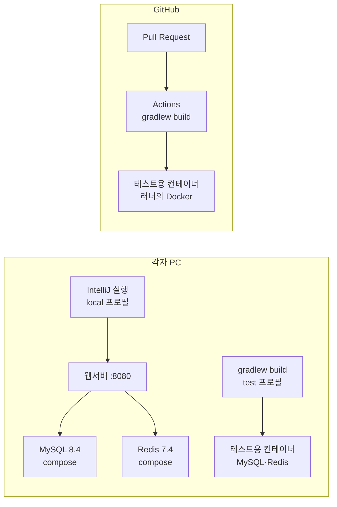

# 웹서버 초기 세팅 명세

> 기준: 2026-10-06, 첫 PR(`feat/init-webserver` → `dev`)의 커밋 8개 · 읽는 사람: 팀원 전원(b·c·d)과 AI 에이전트
>
> 이 문서는 **무엇이 왜 이렇게 세팅되어 있는가**를 적습니다. 설치 순서만 필요하면 [README](../README.md) "처음 받기"를 보세요.
> API 규칙은 루트 `docs/contracts/`, 결정 근거는 [ADR 0001](decisions/0001-초기-설정.md), 새 API 만드는 법은 [예시 API 따라 하기](guides/example-api.md)에 있습니다.

## 목차

1. [한눈에 보기](#1-한눈에-보기)
2. [이 세팅을 만든 과정](#2-이-세팅을-만든-과정)
3. [파일 지도](#3-파일-지도)
4. [빌드: Gradle](#4-빌드-gradle)
5. [의존성과 외부 프레임워크](#5-의존성과-외부-프레임워크)
6. [설정과 프로필](#6-설정과-프로필)
7. [환경 변수와 비밀값](#7-환경-변수와-비밀값)
8. [로컬 인프라: Docker Compose](#8-로컬-인프라-docker-compose)
9. [앱이 뜨는 순서](#9-앱이-뜨는-순서)
10. [요청과 오류가 흐르는 길](#10-요청과-오류가-흐르는-길)
11. [DB 스키마와 영속성](#11-db-스키마와-영속성)
12. [테스트](#12-테스트)
13. [CI: GitHub Actions](#13-ci-github-actions)
14. [편집기·Git 설정 파일](#14-편집기git-설정-파일)
15. [문서와 규칙](#15-문서와-규칙)
16. [커밋 8개 상세](#16-커밋-8개-상세)
17. [팀원이 쓰는 법](#17-팀원이-쓰는-법)
18. [바꿀 때 지킬 것](#18-바꿀-때-지킬-것)

---

## 1. 한눈에 보기

### 1-1. 이 세팅이 주는 것

| 영역 | 하는 일 | 핵심 파일 |
|---|---|---|
| 빌드 | 모두가 같은 Gradle·같은 Java 버전으로 컴파일·테스트·패키징한다 | `build.gradle`, `gradlew`, `gradle/wrapper/` |
| 설정 | 공통 설정 + 환경별(local·test·prod) 설정. 비밀값은 환경 변수로만 받는다 | `src/main/resources/application*.properties` |
| 로컬 인프라 | 각자 PC에 MySQL·Redis를 Docker로 띄운다 | `compose.yaml`, `.env` |
| DB | 스키마는 Flyway SQL 파일로만 바꾸고, Hibernate는 맞는지 검사만 한다 | `db/migration/`, `BaseEntity` |
| 오류 | 모든 오류를 같은 JSON 모양 `{code, message, path, errors}`으로 돌려준다 | `common/error/` |
| 테스트 | 실제 MySQL·Redis(테스트용 컨테이너)로 통합 테스트를 돌린다 | `src/test/` |
| CI | PR마다 빌드·테스트를 GitHub에서 자동으로 돌린다 | `.github/workflows/ci.yml` |
| 견본 | 요청이 DB까지 흐르는 학습용 API 하나(S1 병합 때 삭제) | `example/`, `docs/guides/example-api.md` |
| 규칙·문서 | 사람·AI 작업 규칙, 결정 기록, 문제 해결 기록 | `AGENTS.md`, `docs/` |

### 1-2. 버전

버전은 Spring Boot가 관리하는 값(BOM)을 따르므로 `build.gradle`에는 springdoc 말고는 버전을 적지 않습니다. Boot를 올리면 함께 바뀝니다. 아래는 2026-10-06 빌드·실행에서 확인한 값입니다.

| 구성 요소 | 버전 | 비고 |
|---|---|---|
| Java | 21 | Gradle 툴체인. 배포판은 상관없음(Sang PC: Microsoft OpenJDK 21.0.12.1, CI: Microsoft 21) |
| Gradle | 9.5.1 | Wrapper가 받음 |
| Spring Boot | 4.1.1 | |
| Spring Framework | 7.0.9 | Spring MVC, Spring Test 포함 |
| Hibernate ORM | 7.4.5.Final | JPA 구현체 |
| Jackson | 3.1.5 | JSON 변환. 패키지가 `tools.jackson`으로 바뀜 |
| Flyway | 12.4.0 | DB 마이그레이션 |
| MySQL Connector/J | 9.7.0 | MySQL JDBC 드라이버 |
| HikariCP | 7.0.2 | DB 커넥션 풀 |
| Apache Tomcat | 11.0.24 | 내장 웹 서버 |
| Lettuce | 7.5.2 | Redis 클라이언트 |
| Lombok | 1.18.46 | 코드 생성 |
| JUnit | 6.0.3 | 테스트 |
| Testcontainers | 2.0.5 | 테스트용 컨테이너 |
| springdoc-openapi | 3.1.1 | Swagger UI. 유일하게 버전을 직접 적는 의존성 |
| MySQL(이미지) | 8.4 | compose와 테스트가 같은 버전 |
| Redis(이미지) | 7.4-alpine | compose와 테스트가 같은 버전 |

### 1-3. 세 가지 실행 환경

같은 코드가 세 곳에서 돕니다. 어디서 도느냐에 따라 프로필과 DB가 달라집니다.



| 환경 | 언제 | 프로필 | MySQL·Redis | 비밀값 |
|---|---|---|---|---|
| 로컬 실행 | IntelliJ에서 실행 | `local`(기본) | `compose.yaml`이 띄운 컨테이너 | `.env`, IntelliJ 실행 구성의 환경 변수 |
| 테스트 | `.\gradlew build`, IntelliJ에서 테스트 실행 | `test` | 테스트가 시작될 때 Testcontainers가 띄우고 끝나면 지움 | 필요 없음 |
| CI | PR을 올리거나 커밋을 더할 때 | `test` | GitHub 러너의 Docker로 Testcontainers | 필요 없음 |
| 배포(예정) | 배포 계획(D-4) 뒤 | `prod` | 배포 환경의 DB·Redis | 배포 환경 변수 |

---

## 2. 이 세팅을 만든 과정

1. **결정(10/5)**: 과제 두 개(basic·expert)를 각 프로젝트의 AI 에이전트가 분석하고, 그 보고서를 근거로 39개 항목(W01~W39)을 정했습니다. 내용은 [ADR 0001](decisions/0001-초기-설정.md)에 있습니다.
2. **공통 명세 먼저(10/5)**: 루트 PW01의 PR #1로 기준 브랜치(PW01 `main`, 게임·웹서버 `dev`), DS 내용 정리, 공통 API 규칙(경로·시각·오류 응답·모르는 필드), 예시 API 명세를 먼저 병합했습니다. "코드보다 명세 먼저" 규칙 때문입니다.
3. **저장소 준비(10/6)**: 웹서버에 `dev` 브랜치를 만들고 GitHub 기본 브랜치를 `dev`로 바꿨습니다. `.env.example`에 `REDIS_PASSWORD`를 추가했습니다(`dev` 커밋 `533be7f`).
4. **골격 생성**: IntelliJ의 New Project → Spring Boot(Spring Initializr)로 저장소 밖 임시 폴더에 프로젝트를 만들고, 필요한 파일만 옮겼습니다.
   - 옮기지 않은 것: `HELP.md`(생성기 안내문), `.gitignore`(기존 것이 더 넓고 `.env` 규칙이 있음), `.idea/`·`*.iml`(개인 IDE 설정), `TestPw01WebserverApplication.java`(로컬 실행은 compose로 통일)
   - 바꾼 것: Gradle 래퍼 9.7.1 → 9.5.1(두 과제에서 검증된 버전), springdoc 추가
5. **커밋 8개로 쌓기**: 골격 → 설정 → compose → 테스트 → CI → 공통 오류 틀 → 예시 API → 문서. 커밋끼리 파일이 겹치지 않게 나눠, 커밋 하나만 봐도 무엇이 들어왔는지 알 수 있습니다([16장](#16-커밋-8개-상세)).
6. **검증(10/6)**:
   - `.\gradlew build`: 테스트 17개 통과, 실패 0
   - `docker compose up -d`: MySQL·Redis 모두 healthy
   - local 프로필 실행: `/actuator/health` → `{"groups":["liveness","readiness"],"status":"UP"}`
   - Swagger에서 `POST /api/v1/examples` → 201, `Location: /api/v1/examples/1`, `createdAt`은 밀리초까지 UTC(`…Z`)
7. **겪은 문제 3개**: 포트 3306 충돌, 프로필 없이 실행, PC의 다른 MySQL에 접속. [트러블슈팅](troubleshooting/README.md)에 적었습니다.

---

## 3. 파일 지도

"커밋"은 이 파일을 처음 넣은 커밋입니다([16장](#16-커밋-8개-상세)). "처음부터"는 첫 PR 전부터 있던 파일입니다.

### 3-1. 저장소 맨 위

| 파일 | 역할 | 언제 고치나 | 커밋 |
|---|---|---|---|
| `build.gradle` | 빌드 정의: 플러그인, Java 버전, 의존성, 테스트 설정 | 의존성을 더하거나 빌드 동작을 바꿀 때 | C1 |
| `settings.gradle` | Gradle 프로젝트 이름(`pw01-webserver`). jar 파일 이름에 쓰인다 | 거의 안 고침 | C1 |
| `gradlew`, `gradlew.bat` | Gradle 래퍼 실행 스크립트(리눅스·맥용 / 윈도우용). Gradle을 따로 설치하지 않아도 된다 | 안 고침 | C1 |
| `gradle/wrapper/gradle-wrapper.properties` | 래퍼가 받을 Gradle 배포판 주소(9.5.1) | Gradle 버전을 바꿀 때 | C1 |
| `gradle/wrapper/gradle-wrapper.jar` | 래퍼 본체. 배포판을 받아 실행하는 작은 프로그램 | 안 고침 | C1 |
| `.gitattributes` | 줄바꿈·바이너리 저장 규칙 | 거의 안 고침 | C1 |
| `.editorconfig` | 편집기 공통 설정(모든 파일 UTF-8) | 거의 안 고침 | C2 |
| `.gitignore` | git이 무시할 파일(`.env`, `build/`, `.idea/` …) | 무시할 것이 생길 때 | 처음부터 |
| `compose.yaml` | 로컬 MySQL·Redis 컨테이너 정의 | 로컬 인프라를 바꿀 때 | C3 |
| `.env.example` | 환경 변수 **이름** 목록(값은 비움). `.env`의 틀 | 로컬에서 쓰는 환경 변수를 더할 때 이름만 추가 | 처음부터 |
| `.env` | 내 PC의 실제 비밀번호·포트. **커밋하지 않음** | 각자 | — |
| `README.md` | 소개, 처음 받기, 구조, 검증 숫자 | 실행 방법·구조가 바뀔 때 | C8 |
| `AGENTS.md` | 사람·AI 작업 규칙. 이 폴더에서는 루트 `AGENTS.md`보다 우선 | 규칙이 바뀔 때 | C8 |
| `CLAUDE.md` | `@AGENTS.md` 한 줄. Claude Code가 `AGENTS.md`를 읽게 한다 | 안 고침 | 처음부터 |
| `.github/workflows/ci.yml` | PR마다 빌드·테스트(CI) | CI 동작을 바꿀 때 | C5 |
| `.github/pull_request_template.md` | PR 본문 틀(확인 항목) | 확인 항목이 바뀔 때 | 처음부터 |

### 3-2. 앱 코드 `src/main/java/com/pw01/webserver/`

| 파일 | 역할 | 언제 고치나 | 커밋 |
|---|---|---|---|
| `Pw01WebserverApplication.java` | 앱 시작점(`main`). JVM 기본 시간대를 UTC로 맞추고 Spring Boot를 띄운다. `@SpringBootApplication`이 이 패키지 아래의 클래스를 자동으로 찾는다(컴포넌트 스캔) | 거의 안 고침 | C1 |
| `common/entity/BaseEntity.java` | 모든 엔티티의 부모. 생성·수정 시각(`createdAt`, `updatedAt`)을 자동으로 채운다 | 모든 테이블에 공통 칼럼을 더할 때 | C2 |
| `config/JpaAuditingConfig.java` | JPA Auditing을 켜고, 시각을 밀리초로 자르는 시각 공급자를 등록한다 | 거의 안 고침 | C2 |
| `common/error/ErrorResponse.java` | 오류 응답 JSON 모양 `{code, message, path, errors}` | 명세(루트 contracts)가 바뀔 때만 | C6 |
| `common/error/CommonErrorCode.java` | 공통 오류 코드 상수: `VALIDATION_FAILED`, `INVALID_REQUEST_BODY`, `INTERNAL_ERROR` | 공통 코드가 늘 때(명세 먼저) | C6 |
| `common/error/ApiException.java` | 서버가 의도적으로 거절할 때 던지는 예외의 부모. HTTP 상태와 오류 코드를 들고 다닌다 | 안 고침 | C6 |
| `common/error/NotFoundException.java` | 404: 찾는 대상이 없음 | 안 고침 | C6 |
| `common/error/ConflictException.java` | 409: 이미 있음·이미 처리됨 | 안 고침 | C6 |
| `common/error/ForbiddenException.java` | 403: 권한 없음 | 안 고침 | C6 |
| `common/error/InvalidRequestException.java` | 400: 형식은 맞지만 판정에서 거절 | 안 고침 | C6 |
| `common/error/ServiceUnavailableException.java` | 503: DB·Redis 등 문제로 지금은 처리할 수 없음 | 안 고침 | C6 |
| `common/error/GlobalExceptionHandler.java` | 모든 예외를 공통 오류 응답으로 바꾼다([10장](#10-요청과-오류가-흐르는-길)) | 오류 처리 규칙이 바뀔 때 | C6 |
| `example/controller/ExampleController.java` | 예시 API 경로(`POST /api/v1/examples`, `GET /api/v1/examples/{id}`) | 고치지 않음(S1 때 삭제) | C7 |
| `example/dto/ExampleCreateRequest.java` | 요청 record + 검증 규칙 | 〃 | C7 |
| `example/dto/ExampleResponse.java` | 응답 record + `from(entity)` 변환 | 〃 | C7 |
| `example/entity/Example.java` | `example` 테이블과 짝인 엔티티 | 〃 | C7 |
| `example/repository/ExampleRepository.java` | DB 접근(`JpaRepository` + `existsByName`) | 〃 | C7 |
| `example/service/ExampleService.java` | 판정·트랜잭션·중복 처리 | 〃 | C7 |

### 3-3. 설정·마이그레이션 `src/main/resources/`

| 파일 | 역할 | 언제 고치나 | 커밋 |
|---|---|---|---|
| `application.properties` | 모든 환경 공통 설정 | 공통 설정을 바꿀 때 | C2 |
| `application-local.properties` | 각자 PC(compose) 접속 설정 | 로컬 접속 방식이 바뀔 때 | C2 |
| `application-prod.properties` | 배포 서버 접속 설정(전부 환경 변수) | 배포 계획(D-4) 때 | C2 |
| `db/migration/V1__example.sql` | 예시 테이블을 만드는 Flyway 마이그레이션 | **고치지 않음**. 바꿀 것은 새 파일(V2…)로 | C7 |

### 3-4. 테스트 `src/test/`

| 파일 | 역할 | 커밋 |
|---|---|---|
| `java/.../IntegrationTest.java` | 통합 테스트용 애너테이션 묶음(앱 전체 + MockMvc + test 프로필 + 컨테이너 + UTF-8) | C4 |
| `java/.../TestcontainersConfiguration.java` | 테스트용 MySQL·Redis 컨테이너 정의. 이미지는 compose와 같은 버전으로 고정 | C4 |
| `java/.../MockMvcUtf8Config.java` | MockMvc가 응답을 UTF-8로 읽게 한다(한글 메시지 비교용) | C4 |
| `java/.../ApplicationSmokeTest.java` | 앱 전체가 뜨는지, health가 UP인지 | C4 |
| `java/.../InfraConnectionTest.java` | MySQL `SELECT 1`, Redis `PING` | C4 |
| `java/.../common/error/GlobalExceptionHandlerTest.java` | 공통 오류 틀 7가지 경우(예시 API를 지워도 남음) | C6 |
| `java/.../example/ExampleApiTest.java` | 예시 API 6가지 경우(예시와 함께 삭제) | C7 |
| `resources/application-test.properties` | test 프로필 설정 | C2 |

### 3-5. 문서 `docs/`

| 파일 | 역할 | 커밋 |
|---|---|---|
| `docs/README.md` | 웹서버 문서 지도 | C8 |
| `docs/overview.md` | 구조·프로필·환경 변수 표(요약) | C8 |
| `docs/initial-setup.md` | 이 문서(세팅 명세) | C8 |
| `docs/guides/example-api.md` | 예시 API 따라 하기(b·c·d 파트별). S1 때 삭제 | C7 |
| `docs/decisions/0001-초기-설정.md` | 결정 기록(ADR): W01~W39, 근거, 대가, 대안 | C8 |
| `docs/troubleshooting/README.md` | 문제 해결 기록 | C8 |

### 3-6. 만들어지지만 커밋하지 않는 것

| 경로 | 무엇 | 지워도 되나 |
|---|---|---|
| `build/` | 컴파일 결과, 실행 jar, 테스트 결과·보고서 | 됨(`.\gradlew clean`). 다음 빌드 때 다시 생김 |
| `.gradle/` | 이 프로젝트의 Gradle 작업 캐시 | 됨 |
| `.idea/`, `*.iml` | IntelliJ 개인 설정(실행 구성 포함) | 지우면 IntelliJ 설정을 다시 해야 함 |
| `.env` | 내 비밀번호·포트 | 지우면 compose와 실행이 실패함 |

---

## 4. 빌드: Gradle

### 4-1. Gradle Wrapper

`.\gradlew <작업>`을 실행하면 래퍼(`gradle-wrapper.jar`)가 `gradle-wrapper.properties`의 주소에서 Gradle 9.5.1을 내려받아 실행합니다. 받은 Gradle은 `%USERPROFILE%\.gradle\wrapper\dists`에 남아 다음부터는 바로 씁니다. 그래서 팀원 모두 Gradle을 설치하지 않고도 **같은 버전**으로 빌드합니다.

| 설정(`gradle-wrapper.properties`) | 뜻 |
|---|---|
| `distributionUrl=…/gradle-9.5.1-bin.zip` | 받을 Gradle 배포판. 버전을 바꾸려면 이 줄을 고친다 |
| `distributionBase`, `distributionPath`, `zipStoreBase`, `zipStorePath` | 받은 파일을 둘 위치(사용자 폴더의 `.gradle`) |
| `networkTimeout=10000` | 내려받기 제한 시간(밀리초) |
| `validateDistributionUrl=true` | 주소가 올바른지 확인한 뒤 받는다 |
| `retries`, `retryBackOffMs` | 내려받기 재시도 횟수와 간격 |

- Windows의 cmd와 PowerShell(IntelliJ 터미널 기본)에서는 `.\gradlew`로 실행합니다. Git Bash·리눅스·맥은 `./gradlew`입니다.
- `gradlew`는 실행 권한이 있어야 CI(리눅스)에서 돕니다. 커밋할 때 `git add --chmod=+x gradlew`로 권한을 기록했습니다.

### 4-2. Java 툴체인

```groovy
java {
    toolchain {
        languageVersion = JavaLanguageVersion.of(21)
    }
}
```

- 컴파일·테스트·실행은 **JDK 21**로 합니다. Gradle은 PC에 설치된 JDK 중 21을 찾아 씁니다. 찾는 곳은 `JAVA_HOME`, Windows 레지스트리, IntelliJ가 받은 JDK(사용자 폴더의 `.jdks`) 등입니다.
- Gradle 자체는 다른 JDK(17 이상)로 돌아도 됩니다. 예: Sang PC는 터미널 `java`가 Zulu 17인데, Gradle이 IntelliJ가 받은 Microsoft JDK 21을 찾아 썼습니다.
- 확인: `.\gradlew -q javaToolchains`가 찾은 JDK 목록을 보여 줍니다.
- 못 찾으면 `Cannot find a Java installation on your machine matching this tasks requirements: {languageVersion=21 …}` 오류가 납니다. JDK 21을 설치하거나 `JAVA_HOME`을 JDK 21 폴더로 잡습니다.

### 4-3. 플러그인

| 플러그인 | 하는 일 |
|---|---|
| `java` | 컴파일·테스트·jar 같은 기본 작업 |
| `org.springframework.boot` (4.1.1) | `bootRun`(앱 실행), `bootJar`(의존성을 모두 담은 실행 jar), `developmentOnly` 구성. 컴파일러에 `-parameters`를 붙여 메서드 파라미터 이름을 남긴다(`@PathVariable Long id`의 `id`를 이름으로 찾는 데 필요) |
| `io.spring.dependency-management` (1.1.7) | Spring Boot의 버전 목록(BOM)을 가져온다. 그래서 스타터에 버전을 적지 않는다 |

### 4-4. 프로젝트 정보와 테스트 작업

| 항목 | 값 | 뜻 |
|---|---|---|
| `group` | `com.pw01` | 조직 이름. 패키지 이름의 앞부분 |
| `version` | `0.0.1-SNAPSHOT` | jar 이름에 붙는 버전(`build/libs/pw01-webserver-0.0.1-SNAPSHOT.jar`) |
| `description` | `pw01-webserver` | 설명 |
| `tasks.named('test')` → `useJUnitPlatform()` | JUnit 6(JUnit Platform)으로 테스트를 돌린다 | |
| `systemProperty 'user.timezone', 'UTC'` | 테스트 JVM의 시간대를 UTC로(앱은 `main`에서 맞춤) | |

Gradle 9는 테스트 소스가 있는데 테스트가 하나도 발견되지 않으면 빌드를 실패시킵니다. 이 기본값을 끄지 않았습니다. "테스트 통과"가 아무것도 보증하지 않는 상태를 막기 위해서입니다.

### 4-5. 자주 쓰는 작업

| 명령 | 하는 일 |
|---|---|
| `.\gradlew build` | 컴파일 + 테스트 + jar. **PR 전에 항상** |
| `.\gradlew test` | 테스트만 |
| `.\gradlew test --tests "*ExampleApiTest"` | 테스트 클래스 하나만 |
| `.\gradlew bootJar` | 실행 jar만 만든다 |
| `.\gradlew clean` | `build/`를 지운다 |
| `.\gradlew -q javaToolchains` | Gradle이 찾은 JDK 목록 |
| `.\gradlew dependencies --configuration runtimeClasspath` | 실행 때 실제로 들어가는 의존성 트리 |

결과는 `build/libs/`(jar), `build/reports/tests/test/index.html`(테스트 보고서, 브라우저로 연다), `build/test-results/test/`(XML)에 생깁니다.

---

## 5. 의존성과 외부 프레임워크

### 5-1. 의존성 구성의 뜻

| 구성 | 뜻 | 예 |
|---|---|---|
| `implementation` | 컴파일과 실행 모두에 필요 | 스타터들 |
| `runtimeOnly` | 실행 때만 필요(코드에서 직접 쓰지 않음) | MySQL 드라이버 |
| `compileOnly` + `annotationProcessor` | 컴파일할 때 코드만 만들어 주고 jar에는 들어가지 않음 | Lombok |
| `developmentOnly` | 로컬 실행 때만. 실행 jar·테스트에는 들어가지 않음 | devtools |
| `testImplementation`, `testRuntimeOnly`, `testCompileOnly`, `testAnnotationProcessor` | 테스트에서만 | 테스트 스타터, Testcontainers |

### 5-2. 앱 의존성

| 의존성 | 함께 들어오는 것 | 이 프로젝트에서 하는 일 | 쓰는 곳 |
|---|---|---|---|
| `spring-boot-starter-webmvc` | Spring MVC 7, 내장 Tomcat 11, Jackson 3 | HTTP 요청을 컨트롤러로 연결하고, JSON과 객체를 서로 바꾸고, 8080 포트로 서버를 연다. Boot 4에서 이름이 `starter-web`에서 바뀌었다 | `ExampleController`, `GlobalExceptionHandler` |
| `spring-boot-starter-validation` | Hibernate Validator(Jakarta Bean Validation) | `@NotBlank`, `@Size` 같은 규칙을 `@Valid`가 붙은 요청에 적용한다 | `ExampleCreateRequest` |
| `spring-boot-starter-data-jpa` | Spring Data JPA, Hibernate ORM 7, HikariCP, JDBC | 엔티티와 테이블을 짝짓고, 인터페이스만으로 Repository를 만들고, `@Transactional`로 트랜잭션을 묶는다. HikariCP가 DB 연결을 미리 열어 두고 돌려 쓴다 | `BaseEntity`, `Example`, `ExampleRepository`, `ExampleService` |
| `spring-boot-starter-flyway` + `flyway-mysql` | Flyway 12와 MySQL 지원 모듈 | 앱이 뜰 때 `db/migration`의 SQL 파일을 버전 순서대로 한 번씩 적용하고, 적용 이력을 `flyway_schema_history` 테이블에 남긴다. Flyway는 DB별 지원을 모듈로 나눠 두어 MySQL에는 `flyway-mysql`이 따로 필요하다 | `V1__example.sql` |
| `mysql-connector-j` (runtimeOnly) | MySQL JDBC 드라이버 9.7 | `jdbc:mysql://…` 주소로 MySQL에 접속한다 | DataSource |
| `spring-boot-starter-data-redis` | Spring Data Redis, Lettuce | `RedisTemplate`·`StringRedisTemplate`으로 Redis 명령을 보낸다. Redis 저장소 기능(`@RedisHash`)은 꺼 두었다. 실제 사용은 중복 방지 키·세션(S1·S5)부터 | `InfraConnectionTest` |
| `spring-boot-starter-actuator` | Actuator | `/actuator/health`로 앱과 DB·Redis 연결 상태를 알려 준다. 웹에는 health만 연다 | 로컬 확인, 스모크 테스트, 배포 상태 확인 |
| `spring-boot-starter-websocket` | Spring WebSocket | 지금은 의존성만 있다. 서버 알림(S7) 때 설정·핸들러를 만든다 | — |
| `springdoc-openapi-starter-webmvc-ui` 3.1.1 | OpenAPI 문서 생성기, Swagger UI | 코드에서 API 문서를 만들어 `/swagger-ui/index.html`에서 보여 주고 직접 호출해 볼 수 있다. **확인용 보기**이고 명세 원본은 루트 `docs/contracts/`다. 3.1.x가 Boot 4.1 대응판이다 | 로컬 확인 |
| `lombok` (compileOnly + annotationProcessor) | Lombok | 컴파일할 때 getter·생성자를 만들어 준다(`@Getter`, `@NoArgsConstructor`, `@RequiredArgsConstructor`) | 엔티티, 서비스, 예외 |
| `spring-boot-devtools` (developmentOnly) | DevTools | 로컬 실행 중 클래스가 바뀌면 앱을 자동으로 다시 띄운다(로그의 `restartedMain`) | 로컬 실행 |

### 5-3. 테스트 의존성

| 의존성 | 하는 일 |
|---|---|
| `spring-boot-starter-actuator-test`, `-data-jpa-test`, `-data-redis-test`, `-flyway-test`, `-validation-test`, `-webmvc-test`, `-websocket-test` | Boot 4에서 기술별로 나뉜 테스트 스타터. 공통으로 JUnit 6, AssertJ, Hamcrest, Mockito, JsonPath, Spring Test(MockMvc)를 가져오고, 각 기술의 테스트 설정을 더한다. 예: `webmvc-test`가 `@WebMvcTest`, `@AutoConfigureMockMvc`를 준다 |
| `spring-boot-testcontainers` | `@ServiceConnection`: 테스트 컨테이너의 주소·계정을 Spring 설정(DataSource·Redis)에 자동으로 넣는다 |
| `testcontainers-junit-jupiter`, `testcontainers-mysql` | Testcontainers 2 본체, JUnit 연동, `MySQLContainer` 클래스. 2.x에서 모듈 이름에 `testcontainers-`가 붙었다 |
| `junit-platform-launcher` (testRuntimeOnly) | Gradle이 JUnit 테스트를 찾아 실행하는 데 필요 |
| `lombok` (testCompileOnly, testAnnotationProcessor) | 테스트 코드에서도 Lombok |

### 5-4. 외부 도구

| 도구 | 하는 일 |
|---|---|
| Docker Desktop | compose(로컬 MySQL·Redis)와 Testcontainers(테스트용 컨테이너)가 쓴다. **꺼져 있으면 테스트와 compose가 모두 실패한다** |
| IntelliJ IDEA Ultimate | 프로젝트 생성(Spring Initializr), 실행 구성, Gradle 연동, HTTP Client |
| GitHub Actions | PR마다 빌드·테스트(CI) |
| MySQL 8.4 | 계정·기록 같은 영구 데이터 |
| Redis 7.4 | 빠르게 바뀌는 상태. 키 규칙은 루트 `docs/contracts/redis-keys.md` |

### 5-5. Spring Boot 4에서 바뀐 것(과제 때와 다른 점)

| 바뀐 것 | 이 프로젝트에서 |
|---|---|
| Jackson 2 → 3 | 코드 패키지는 `tools.jackson.*`. 애너테이션은 그대로 `com.fasterxml.jackson.annotation`(`@JsonInclude` 등) |
| 웹 스타터 이름 | `spring-boot-starter-webmvc` |
| 스타터·자동 설정이 기술별 모듈로 나뉨 | Flyway는 `spring-boot-starter-flyway`가 있어야 자동으로 돈다. 테스트 스타터도 기술마다 있다 |
| 테스트 애너테이션 패키지 | `@WebMvcTest`, `@AutoConfigureMockMvc`는 `org.springframework.boot.webmvc.test.autoconfigure` |
| Hibernate 6 → 7, JUnit 5 → 6 | 코드에 쓰는 방법은 거의 같다 |
| Testcontainers 1 → 2 | 모듈 이름(`testcontainers-mysql`), 클래스 위치(`org.testcontainers.mysql.MySQLContainer`) |

---

## 6. 설정과 프로필

### 6-1. 프로필이 정해지는 방식

`application.properties`는 항상 읽고, 켜진 프로필의 `application-<프로필>.properties`를 그 위에 덮어씁니다.

| 프로필 | 켜지는 때 | 추가로 읽는 파일 | 접속 대상 |
|---|---|---|---|
| `local` | 프로필을 정하지 않고 실행할 때(`spring.profiles.default=local`) | `application-local.properties` | compose의 MySQL·Redis |
| `test` | 테스트(`@IntegrationTest`, `@ActiveProfiles("test")`) | `src/test/resources/application-test.properties` | Testcontainers가 띄운 MySQL·Redis |
| `prod` | 배포 서버에서 환경 변수 `SPRING_PROFILES_ACTIVE=prod` | `application-prod.properties` | 배포 환경 변수 |

- 기동 로그에서 `The following 1 profile is active: "local"`으로 확인합니다.
- 프로필은 환경 변수 `SPRING_PROFILES_ACTIVE`, JVM 옵션 `-Dspring.profiles.active`, IntelliJ 실행 구성의 Active profiles 칸으로도 정할 수 있습니다. 정하면 기본값(local)보다 우선합니다.

### 6-2. `application.properties`(공통)

| 키 | 값 | 뜻과 이유 |
|---|---|---|
| `spring.application.name` | `pw01-webserver` | 앱 이름. 로그 앞의 `[pw01-webserver]` |
| `spring.profiles.default` | `local` | 프로필을 정하지 않으면 local. 첫 로컬 실행에서 프로필을 빠뜨려 기동이 실패했던 일 때문에 넣었다 |
| `spring.jpa.hibernate.ddl-auto` | `validate` | Hibernate는 테이블을 만들거나 고치지 않고, 엔티티와 테이블이 맞는지만 검사한다. 스키마는 Flyway가 만든다(W15) |
| `spring.jpa.open-in-view` | `false` | 요청이 끝날 때까지 DB 연결·영속성 컨텍스트를 붙잡지 않는다. 엔티티의 지연 로딩은 트랜잭션(Service) 안에서만 된다(W17) |
| `spring.jpa.properties.hibernate.jdbc.time_zone` | `UTC` | 시각을 DB에 쓰고 읽을 때 UTC를 기준으로 바꾼다(W14·W17) |
| `spring.jpa.properties.hibernate.type.preferred_instant_jdbc_type` | `TIMESTAMP` | 자바 `Instant`를 MySQL `DATETIME` 칼럼에 매핑한다. 이 값이 없으면 Hibernate는 MySQL `TIMESTAMP` 칼럼을 기대한다 |
| `#spring.data.web.pageable.max-page-size=` | (주석) | 목록 API의 페이지 크기 상한. 값은 목록 API를 설계할 때 정한다(W17) |
| `spring.data.redis.repositories.enabled` | `false` | Redis는 RedisTemplate으로만 쓰므로 Redis 저장소 스캔을 끈다(JPA 저장소에 대한 안내 로그 제거) |
| `spring.jackson.deserialization.fail-on-unknown-properties` | `true` | 요청 JSON에 모르는 필드가 있으면 400. Spring Boot는 이 기능을 기본으로 꺼서 모르는 필드를 무시하므로 다시 켰다(W30, 루트 공통 규칙) |
| `management.endpoints.web.exposure.include` | `health` | Actuator 엔드포인트 중 health만 웹에 연다 |

### 6-3. `application-local.properties`

| 키 | 값 | 뜻 |
|---|---|---|
| `spring.datasource.url` | `jdbc:mysql://127.0.0.1:${MYSQL_PORT:3306}/${MYSQL_DATABASE:pw01}` | compose MySQL 주소. `127.0.0.1`은 compose 포트가 IPv4에만 열려 있어서다 |
| `spring.datasource.username` | `${MYSQL_USER:pw01}` | 앱 계정 |
| `spring.datasource.password` | `${MYSQL_PASSWORD}` | 비밀번호. 기본값 없음 |
| `spring.data.redis.host` / `port` / `password` | `127.0.0.1` / `${REDIS_PORT:6379}` / `${REDIS_PASSWORD}` | compose Redis |
| `logging.level.org.hibernate.SQL` | `debug` | 실행한 SQL을 로그로 본다(local에서만, W17) |

`${이름:기본값}`은 "환경 변수(또는 설정) `이름`의 값, 없으면 기본값"이라는 뜻입니다. `${이름}`처럼 기본값이 없으면, 값이 없을 때 `Could not resolve placeholder '이름'` 오류로 기동이 멈춥니다. 비밀번호에 기본값을 두지 않은 이유입니다. 빠졌을 때 틀린 값으로 조용히 뜨는 대신 바로 알 수 있습니다(W13).

### 6-4. `application-prod.properties`

`DB_URL`, `DB_USERNAME`, `DB_PASSWORD`, `REDIS_HOST`, `REDIS_PORT`, `REDIS_PASSWORD`를 모두 환경 변수로만 받습니다. 기본값이 없어서 하나라도 빠지면 기동이 실패합니다. 값은 배포 계획(D-4) 때 AWS Parameter Store 등에서 넣습니다.

### 6-5. `application-test.properties`

`spring.main.banner-mode=off` 하나입니다. 테스트 로그에서 Spring 배너를 뺍니다. DB·Redis 접속 정보는 Testcontainers의 `@ServiceConnection`이 넣으므로 적지 않습니다.

### 6-6. 어느 값이 이기나

같은 키가 여러 곳에 있으면 위쪽이 이깁니다(줄인 목록).

1. 명령줄 인자(`--server.port=9090` 등)
2. 환경 변수(IntelliJ 실행 구성의 Environment variables 포함)
3. `application-<프로필>.properties`
4. `application.properties`

환경 변수 이름은 설정 키로도 읽힙니다. 예를 들어 환경 변수 `SPRING_DATASOURCE_URL`은 `spring.datasource.url`을 덮어씁니다.

### 6-7. 주의: `.properties`는 값에 ASCII만

Spring Boot는 `.properties` 파일을 따로 정하지 않으면 ISO-8859-1로 읽습니다. 그래서 **설정 값**에 한글을 쓰면 깨질 수 있습니다. 한글은 **주석**(`#` 줄)에만 씁니다. 주석은 읽히지 않으니 상관없고, `.editorconfig` 덕분에 IntelliJ에서도 깨지지 않게 보입니다.

---

## 7. 환경 변수와 비밀값

### 7-1. 원칙

- 비밀번호·키·토큰은 코드와 설정 파일에 **값으로 쓰지 않습니다**. 설정 파일에는 `${MYSQL_PASSWORD}` 같은 자리표시자만 둡니다.
- 비밀값 자리표시자에는 기본값을 두지 않습니다. 빠지면 기동이 실패합니다.
- 로그에 비밀값을 찍지 않습니다.

### 7-2. 어디에 두나

| 상황 | 값을 두는 곳 | 누가 읽나 |
|---|---|---|
| 로컬 compose | `.env`(이 폴더, 커밋 안 함) | `docker compose`가 자동으로 읽는다 |
| 로컬 앱 실행 | IntelliJ 실행 구성의 Environment variables(`.env`와 같은 이름·값) | 앱(Spring)이 환경 변수로 읽는다 |
| 테스트 | 필요 없음 | Testcontainers가 임시 계정을 만든다 |
| CI | 필요 없음 | 〃 |
| 배포 | 배포 환경(D-4에서 정함) | 앱이 환경 변수로 읽는다 |

`.env`는 compose만 읽고 앱은 읽지 않습니다. 그래서 실행 구성에 같은 값을 넣어야 합니다. 특히 `.env`에서 포트를 바꿨다면 실행 구성에도 넣습니다.

### 7-3. 환경 변수 목록

| 이름 | compose | local | prod | 기본값 | 뜻 |
|---|---|---|---|---|---|
| `MYSQL_DATABASE` | ○ | ○ | | `pw01` | DB 이름 |
| `MYSQL_USER` | ○ | ○ | | `pw01` | 앱이 쓰는 DB 계정 |
| `MYSQL_PASSWORD` | ○ | ○ | | 없음 | 앱 계정 비밀번호 |
| `MYSQL_ROOT_PASSWORD` | ○ | | | 없음 | MySQL 관리자 비밀번호(컨테이너 안에서만 씀) |
| `MYSQL_PORT` | ○ | ○ | | `3306` | PC 쪽 MySQL 포트. 다른 MySQL이 3306을 쓰면 바꾼다(예: 3307) |
| `REDIS_PORT` | ○ | ○ | ○ | `6379`(compose·local) | Redis 포트 |
| `REDIS_PASSWORD` | ○ | ○ | ○ | 없음 | Redis 비밀번호 |
| `DB_URL`, `DB_USERNAME`, `DB_PASSWORD`, `REDIS_HOST` | | | ○ | 없음 | 배포 환경의 접속 정보 |

### 7-4. `.env`와 `.env.example`

- `.env.example`: 이름만 적은 틀. 커밋합니다. 새 로컬 환경 변수를 쓰면 여기에 **이름만** 더합니다.
- `.env`: `.env.example`을 복사해 값을 채운 내 파일. `.gitignore`의 `.env`, `.env.*`(단 `!.env.example`) 규칙으로 커밋되지 않습니다.
- 값은 따옴표 없이 `이름=값`으로 씁니다.

### 7-5. 주의: MySQL 계정은 처음 한 번만 만들어진다

MySQL 컨테이너는 **데이터 볼륨이 비어 있을 때**(처음 `up` 할 때)만 `MYSQL_DATABASE`, `MYSQL_USER`, `MYSQL_PASSWORD`로 DB와 계정을 만듭니다. 나중에 `.env`의 비밀번호를 바꿔도 이미 만든 계정의 비밀번호는 그대로라 접속이 실패합니다.

- 데이터를 지워도 되면 `docker compose down -v`(**데이터 삭제**) 뒤 다시 `docker compose up -d`
- 데이터를 남기려면 컨테이너 안에서 관리자 계정으로 비밀번호를 바꿉니다

---

## 8. 로컬 인프라: Docker Compose

### 8-1. `compose.yaml` 항목별 뜻

| 항목 | 값 | 뜻 |
|---|---|---|
| `name` | `pw01-local` | compose 프로젝트 이름. 컨테이너 이름 앞부분(`pw01-local-mysql-1`) |
| `mysql.image` | `mysql:8.4` | MySQL 이미지. 테스트(`TestcontainersConfiguration`)와 같은 버전 |
| `restart` | `unless-stopped` | Docker Desktop이 다시 켜지면 컨테이너도 다시 뜬다(직접 멈춘 것은 제외) |
| `environment.TZ` | `UTC` | 컨테이너 시간대(W14·W18) |
| `MYSQL_DATABASE`, `MYSQL_USER` | `${…:-pw01}` | 처음 뜰 때 만들 DB·계정. `:-pw01`은 "없으면 pw01" |
| `MYSQL_PASSWORD`, `MYSQL_ROOT_PASSWORD` | `${…:?안내 문구}` | `:?`는 "없으면 compose를 멈추고 안내 문구를 보여 준다" |
| `ports` | `127.0.0.1:${MYSQL_PORT:-3306}:3306` | 왼쪽이 PC 포트, 오른쪽이 컨테이너 포트. `127.0.0.1`에만 열어 같은 네트워크의 다른 PC는 접속할 수 없다 |
| `volumes` | `mysql-data:/var/lib/mysql` | 데이터를 Docker 볼륨에 둔다. 컨테이너를 지워도 남고, `down -v`로만 지워진다 |
| `healthcheck` | `mysqladmin ping`, 10초마다, 10번까지 | MySQL이 접속을 받을 준비가 됐는지 확인한다. `docker compose ps`의 `healthy` |
| `healthcheck.start_period` | `30s` | 처음 뜰 때 데이터 초기화가 끝나기 전의 실패는 세지 않는다(W18) |
| `redis.image` | `redis:7.4-alpine` | Redis 이미지. 테스트와 같은 버전 |
| `redis.command` | `redis-server --requirepass ${REDIS_PASSWORD}` | 비밀번호를 걸고 Redis를 띄운다 |
| `redis.environment.REDISCLI_AUTH` | `${REDIS_PASSWORD}` | healthcheck의 `redis-cli`가 이 값으로 인증한다. 명령에 `-a 비밀번호`를 쓰지 않으려는 것 |
| `redis.healthcheck` | `redis-cli ping` 결과가 `PONG`인지 | Redis가 응답하는지 확인 |
| `redis.ports`, `redis.volumes` | `127.0.0.1:${REDIS_PORT:-6379}:6379`, `redis-data:/data` | MySQL과 같은 방식 |

### 8-2. 자주 쓰는 명령(이 폴더에서)

| 명령 | 하는 일 |
|---|---|
| `docker compose up -d` | 띄운다(이미 떠 있으면 바뀐 것만 다시 만든다) |
| `docker compose ps` | 상태. 둘 다 `healthy`면 준비 끝 |
| `docker compose logs -f mysql` | MySQL 로그를 계속 본다(멈추려면 Ctrl+C) |
| `docker compose stop` | 멈춘다(데이터 유지) |
| `docker compose down` | 컨테이너를 지운다(데이터 유지) |
| `docker compose down -v` | 컨테이너와 **데이터까지** 지운다. 팀 규칙상 확인 후에만 |
| `docker compose exec mysql mysql -upw01 -p pw01` | MySQL에 접속한다(비밀번호를 물어봄) |

---

## 9. 앱이 뜨는 순서

IntelliJ에서 실행하면 아래 순서로 진행됩니다. 오른쪽은 그때 보이는 로그입니다.

| 순서 | 일어나는 일 | 로그 |
|---|---|---|
| 1 | `main()`이 JVM 기본 시간대를 UTC로 바꾸고 Spring Boot를 시작한다 | `Starting Pw01WebserverApplication using Java 21…` |
| 2 | 프로필을 정한다(정하지 않았으면 local) | `The following 1 profile is active: "local"` |
| 3 | 설정 파일을 읽고 `${…}` 자리표시자를 환경 변수로 채운다 | 실패하면 `Could not resolve placeholder` |
| 4 | **자동 설정**: 클래스패스에 있는 라이브러리를 보고 Boot가 필요한 객체(빈)를 만든다 | |
| 4-1 | DataSource(HikariCP): MySQL 연결 풀 | |
| 4-2 | Flyway: `db/migration`의 새 파일을 적용 | `Successfully applied 1 migration …` 또는 `Schema … is up to date` |
| 4-3 | JPA(Hibernate): 엔티티를 등록하고 테이블과 비교(`validate`) | 실패하면 `Schema-validation: …` |
| 4-4 | Spring Data: Repository 인터페이스의 구현을 만든다 | `Found 1 JPA repository interface` |
| 4-5 | Redis 연결(Lettuce), JPA Auditing(`JpaAuditingConfig`) | |
| 4-6 | Spring MVC: 요청 분배기(DispatcherServlet), Jackson 3(모르는 필드 400 설정 반영), `GlobalExceptionHandler` 등록 | |
| 4-7 | Actuator(`/actuator/health`), springdoc(`/swagger-ui/index.html`) | |
| 5 | 내장 Tomcat이 8080 포트를 연다 | `Tomcat started on port 8080`, `Started Pw01WebserverApplication in … seconds` |
| 6 | (로컬 실행만) DevTools가 클래스 변경을 지켜보다가 자동으로 다시 띄운다 | 스레드 이름 `restartedMain` |

**기동이 실패할 때 자주 보는 메시지**

| 메시지 | 원인 | 할 일 |
|---|---|---|
| `Failed to configure a DataSource: 'url' attribute is not specified` | 프로필이 없거나 local 설정을 못 읽음 | 기동 로그의 profile 줄 확인 |
| `Could not resolve placeholder 'MYSQL_PASSWORD'` | 실행 구성에 환경 변수가 없음 | 실행 구성에 `.env`와 같은 값 |
| `Access denied for user 'pw01'@'localhost'` | 다른 MySQL(3306)에 붙음, 또는 비밀번호가 다름 | `MYSQL_PORT` 확인([트러블슈팅](troubleshooting/README.md)) |
| `Communications link failure` | MySQL이 꺼져 있음 | `docker compose ps` |
| `Migration checksum mismatch` | 이미 적용된 마이그레이션 파일을 고침 | 파일을 되돌리고 새 파일로 고친다 |
| `Schema-validation: missing table` / `missing column` / `wrong column type` | 엔티티와 테이블이 다름 | 마이그레이션 또는 엔티티를 맞춘다 |
| `Port 8080 was already in use` | 다른 프로그램(또는 이미 실행 중인 앱)이 8080을 씀 | 그 프로그램을 끈다 |

---

## 10. 요청과 오류가 흐르는 길

### 10-1. 정상 요청

```
HTTP 요청 → Tomcat → DispatcherServlet → Controller(@Valid 검증)
         → Service(@Transactional, 판정) → Repository → Hibernate → JDBC(HikariCP) → MySQL
응답 DTO(record) → Jackson 3 → JSON 응답
```

파일 순서대로 따라가는 예시는 [예시 API 따라 하기](guides/example-api.md)에 있습니다.

### 10-2. 오류가 응답이 되는 길

예외가 나면 `GlobalExceptionHandler`가 잡아 공통 오류 응답으로 바꿉니다. 이 클래스는 Spring의 `ResponseEntityExceptionHandler`를 상속해서, Spring MVC 표준 오류도 같은 모양으로 바꿉니다.

| 상황 | 예외 | 상태 | `code` |
|---|---|---|---|
| 본문 필드 검증 실패(`@Valid @RequestBody`) | `MethodArgumentNotValidException` | 400 | `VALIDATION_FAILED`, `errors`에 필드별 목록 |
| 경로·쿼리 값의 형식이 틀림(`/examples/abc`) | `MethodArgumentTypeMismatchException` | 400 | `VALIDATION_FAILED` |
| 경로·쿼리 값에 붙인 제약 위반 | `HandlerMethodValidationException` | 400 | `VALIDATION_FAILED` |
| 필수 쿼리 값 없음 | `MissingServletRequestParameterException` | 400 | `VALIDATION_FAILED` |
| JSON 문법 오류, 모르는 필드, 타입 불일치 | `HttpMessageNotReadableException` | 400 | `INVALID_REQUEST_BODY`(모르는 필드면 메시지에 필드 이름) |
| Service가 거절 | `NotFoundException` 등 상태별 예외 | 404·409·403·400·503 | 던질 때 넣은 코드(예: `EXAMPLE_NOT_FOUND`) |
| 없는 경로 | `NoResourceFoundException` | 404 | `NOT_FOUND` |
| 허용되지 않은 메서드 | `HttpRequestMethodNotSupportedException` | 405 | `METHOD_NOT_ALLOWED` |
| 그 밖의 Spring MVC 표준 오류 | (예: 지원하지 않는 Content-Type) | 그 상태 | 상태 이름(예: `UNSUPPORTED_MEDIA_TYPE`) |
| 예상하지 못한 오류 | 그 밖의 모든 예외 | 500 | `INTERNAL_ERROR`. 원인은 서버 로그에만 남기고 응답에는 넣지 않는다 |

```json
{
  "code": "VALIDATION_FAILED",
  "message": "요청 값이 올바르지 않습니다.",
  "path": "/api/v1/examples",
  "errors": [
    { "field": "name", "message": "이름을 입력해야 합니다." }
  ]
}
```

`errors`는 검증 오류일 때만 붙습니다(`@JsonInclude(NON_NULL)`). 형식의 기준은 루트 `docs/contracts/README.md`입니다.

### 10-3. 시각

- 엔티티·DTO의 시각은 `Instant`(시간대 없는 절대 시각)입니다.
- JSON에서는 `Z`가 붙은 ISO-8601 문자열이고, 초 아래는 밀리초까지입니다. 예: `"2026-10-05T16:52:35.786Z"`. 밀리초가 0이면 생략됩니다.

---

## 11. DB 스키마와 영속성

### 11-1. Flyway 마이그레이션

- 파일 이름: `V{번호}__{설명}.sql`(밑줄 두 개). 예: `V1__example.sql`, `V2__create_account.sql`
- 앱이 뜰 때 아직 적용되지 않은 파일을 번호 순서대로 한 번씩 실행합니다. 적용 기록과 파일 체크섬은 `flyway_schema_history` 테이블에 남습니다.
- **`dev`에 병합된 마이그레이션 파일은 고치지 않습니다.** 고치면 이미 적용한 팀원 DB에서 체크섬이 달라 기동이 실패합니다. 바꿀 것은 새 파일로 더합니다.
- 테스트는 매번 빈 컨테이너 DB에 처음부터 적용하므로, 마이그레이션 오류는 테스트에서 먼저 드러납니다.

### 11-2. Hibernate는 검사만(`ddl-auto=validate`)

Hibernate는 테이블을 만들지 않습니다. 앱이 뜰 때 엔티티와 실제 테이블(이름·칼럼·타입)을 비교해 다르면 기동을 멈춥니다. 그래서 엔티티를 고치면 마이그레이션도 함께 더해야 합니다.

### 11-3. 이름 규칙

엔티티 필드의 camelCase는 칼럼의 snake_case로 자동 대응합니다(Spring Boot 기본 이름 규칙). 예: `createdAt` → `created_at`.

### 11-4. 생성·수정 시각(`BaseEntity` + Auditing)

- 엔티티가 `BaseEntity`를 상속하면 저장할 때 `createdAt`, 고칠 때 `updatedAt`이 자동으로 채워집니다(`@CreatedDate`, `@LastModifiedDate`, `AuditingEntityListener`).
- `JpaAuditingConfig`가 Auditing을 켭니다. 메인 클래스에 두지 않은 이유는 `@WebMvcTest` 같은 슬라이스 테스트가 JPA 없이 뜰 때 깨지지 않게 하려는 것입니다.
- 시각 공급자가 `Instant.now()`를 **밀리초까지 자릅니다**. 테이블 칼럼은 `DATETIME(3)`(밀리초)이라, 저장 직후 응답과 나중에 조회한 응답의 값이 같아집니다.

### 11-5. 시간대가 맞춰지는 곳

| 곳 | 설정 |
|---|---|
| 앱 JVM | `Pw01WebserverApplication.main`의 `TimeZone.setDefault(UTC)` |
| 테스트 JVM | `build.gradle`의 `systemProperty 'user.timezone', 'UTC'` |
| JDBC(Hibernate) | `hibernate.jdbc.time_zone=UTC` |
| MySQL 컨테이너 | `compose.yaml`의 `TZ: UTC` |
| JSON | `Instant` → `…Z` |

어디서 실행해도 저장되는 값은 UTC입니다. 한국 시간으로 보여 주는 것은 게임 화면(UE)이 할 일입니다.

### 11-6. 트랜잭션과 지연 로딩

- Service 클래스에 `@Transactional(readOnly = true)`를 붙이고, 쓰는 메서드에만 `@Transactional`을 다시 붙입니다(`ExampleService`).
- `open-in-view=false`라서 Controller에서는 엔티티의 지연 로딩이 되지 않습니다. 엔티티 → DTO 변환은 Service 안(트랜잭션 안)에서 합니다.

### 11-7. 유일 제약과 중복 요청

예시의 `uk_example_name`처럼, 같은 요청이 두 번 와도 한 번만 반영되게 하는 마지막 방어는 DB 유일 제약입니다. 동시에 온 요청 두 개가 `existsByName` 확인을 함께 통과해도, DB가 두 번째 INSERT를 막고 `ExampleService`가 이를 409로 바꿉니다. 결과 제출·투자처럼 중복이 위험한 기능(C3)에서 같은 방식을 씁니다.

---

## 12. 테스트

### 12-1. 두 종류

| 종류 | 붙이는 것 | 띄우는 범위 | Docker | 쓰는 곳 |
|---|---|---|---|---|
| 통합 테스트 | `@IntegrationTest` | 앱 전체 + MockMvc + test 프로필 + 테스트용 MySQL·Redis | 필요 | 스모크, 연결, 예시 API |
| 웹 계층 테스트 | `@WebMvcTest` + `@ActiveProfiles("test")` | 컨트롤러·`@ControllerAdvice`·JSON만(DB 없음) | 불필요 | 공통 오류 틀 |

`@IntegrationTest`는 `@SpringBootTest`, `@AutoConfigureMockMvc`, `@ActiveProfiles("test")`, `@Import({TestcontainersConfiguration, MockMvcUtf8Config})`를 묶은 애너테이션입니다. 통합 테스트가 모두 같은 애너테이션을 쓰면 Spring이 컨텍스트를 캐시해 **컨테이너를 한 번만** 띄웁니다. 그래서 테스트 클래스마다 MySQL을 새로 띄우지 않습니다.

### 12-2. Testcontainers가 하는 일

1. 통합 테스트 컨텍스트가 뜰 때 `mysql:8.4`, `redis:7.4-alpine` 이미지로 컨테이너를 띄웁니다. 처음에는 이미지를 받느라 오래 걸립니다.
2. 컨테이너의 PC 쪽 포트는 비어 있는 아무 포트입니다. 그래서 compose(3307·6379)와 부딪히지 않습니다.
3. `@ServiceConnection`이 컨테이너의 주소·계정을 DataSource·Redis 설정에 넣습니다.
4. Flyway가 빈 DB에 마이그레이션을 적용하고 Hibernate가 검사합니다. 로컬 DB와 상관없이 매번 깨끗한 DB로 시작합니다.
5. 테스트가 끝나면 Testcontainers의 정리 컨테이너(Ryuk)가 컨테이너를 지웁니다.

Docker가 꺼져 있으면 `Could not find a valid Docker environment`로 실패합니다.

### 12-3. `MockMvcUtf8Config`가 있는 이유

JSON 응답에는 charset이 붙지 않는데, MockMvc는 응답 본문을 기본으로 ISO-8859-1로 읽습니다. 그대로 두면 한글 메시지를 비교하는 테스트가 깨집니다. 테스트에서만 UTF-8로 읽게 했습니다. 실제 서버 응답은 UTF-8이 맞습니다.

### 12-4. 테스트 목록(17개)

| 클래스 | 테스트 | 확인하는 것 |
|---|---|---|
| `ApplicationSmokeTest` | `contextLoads` | 앱 전체가 test 프로필로 뜬다(설정·빈·마이그레이션·스키마 검사) |
| | `healthIsUp` | `/actuator/health`가 UP(MySQL·Redis 연결 포함) |
| `InfraConnectionTest` | `mysqlAnswersSelectOne` | MySQL에 `SELECT 1` |
| | `redisAnswersPing` | Redis에 `PING` → `PONG` |
| `GlobalExceptionHandlerTest` | `validationErrorListsFields` | 검증 실패 → 400 `VALIDATION_FAILED` + 필드 목록 |
| | `unknownFieldIsRejected` | 모르는 필드 → 400 `INVALID_REQUEST_BODY`(메시지에 필드 이름) |
| | `brokenJsonIsRejected` | 깨진 JSON → 400 `INVALID_REQUEST_BODY` |
| | `apiExceptionKeepsStatusAndCode` | 상태별 예외 → 404·409와 넣은 코드 |
| | `pathValueOfWrongTypeIsValidationError` | 경로 값 형식 오류 → 400 `VALIDATION_FAILED` |
| | `unknownPathAndWrongMethodUseStatusNames` | 없는 경로 404 `NOT_FOUND`, 틀린 메서드 405 `METHOD_NOT_ALLOWED` |
| | `unexpectedErrorHidesCause` | 예상 못 한 오류 → 500 `INTERNAL_ERROR`, 원인이 응답에 없음 |
| `ExampleApiTest` | `createThenGet` | 201 + `Location`, 조회 200, 시각 형식 |
| | `blankNameIsValidationError` | 공백 이름 → 400 |
| | `unknownFieldIsRejected` | 모르는 필드 → 400 |
| | `sameNameIsConflict` | 같은 이름 두 번 → 409 `EXAMPLE_NAME_DUPLICATED` |
| | `missingIdIsNotFound` | 없는 id → 404 `EXAMPLE_NOT_FOUND` |
| | `nonNumericIdIsValidationError` | 숫자가 아닌 id → 400 |

### 12-5. 테스트 규칙(W39)

- **필수**: 서버 판정(보상·투자·해금), 중복 방지(같은 요청 반복), 예외(상태 코드·오류 코드)에 걸린 코드
- **권장**: 그 밖의 코드
- 테스트마다 "무엇을 확인하는지, 실패하면 무엇을 의심할지"를 주석으로 적습니다.

### 12-6. 돌리는 법과 결과 보기

- 전체: `.\gradlew build` 또는 `.\gradlew test`
- 하나만: IntelliJ에서 테스트 클래스·메서드 옆의 실행 버튼, 또는 `.\gradlew test --tests "*ExampleApiTest"`
- 결과: `build/reports/tests/test/index.html`(실패한 테스트의 로그·원인)

---

## 13. CI: GitHub Actions

### 13-1. `.github/workflows/ci.yml` 항목별 뜻

| 항목 | 값 | 뜻 |
|---|---|---|
| `on.pull_request.branches` | `dev`, `main` | 이 브랜치로 가는 PR에서 돈다(PR을 열 때, 커밋을 더할 때) |
| `paths-ignore` | `**.md`, `docs/**` | 문서만 바뀐 PR은 돌지 않는다 |
| `permissions` | `contents: read` | 저장소를 읽기만 한다 |
| `concurrency` | PR 번호별, `cancel-in-progress` | 같은 PR에 새 커밋이 오면 이전 실행을 취소한다 |
| `runs-on` | `ubuntu-latest` | GitHub이 주는 리눅스 러너. Docker가 있어 Testcontainers가 돈다 |
| `actions/checkout@v7` | | 코드를 받는다 |
| `actions/setup-java@v6` | `microsoft`, `21` | JDK 21을 설치한다 |
| `gradle/actions/setup-gradle@v6` | | Gradle 캐시(다음 실행이 빨라진다) |
| `./gradlew build` | | 로컬과 같은 빌드·테스트 |
| `actions/upload-artifact@v7` | 실패할 때만 | `build/reports/tests/`를 내려받을 수 있게 올린다 |

### 13-2. 결과 보기

- PR 화면의 Checks에서 초록(통과)·빨강(실패)을 봅니다.
- 실패하면 해당 실행 화면 아래 Artifacts의 `test-reports`를 받아 `index.html`을 엽니다.
- 공개 저장소라 표준 러너 사용료는 들지 않습니다(W01).
- AI 규칙: CI 대상인 PR은 CI가 통과한 뒤에만 병합을 요청합니다(`AGENTS.md`).

---

## 14. 편집기·Git 설정 파일

| 파일 | 내용 | 이유 |
|---|---|---|
| `.gitattributes` | `/gradlew text eol=lf`, `*.bat text eol=crlf`, `*.jar binary` | `gradlew`가 CRLF로 바뀌면 리눅스(CI)에서 실행되지 않고, `.bat`이 LF면 cmd에서 오동작할 수 있다. jar는 줄바꿈 변환을 하지 않는다 |
| `.editorconfig` | 모든 파일 `charset = utf-8` | IntelliJ는 `.properties`를 기본으로 ISO-8859-1로 열어 한글 주석이 깨진다. 이 파일을 IntelliJ가 읽어 UTF-8로 연다 |
| `.gitignore` | `.env`·`.env.*`(단 `.env.example` 제외), `build/`, `.gradle/`, `.idea/`, `*.iml`, `out/`, `HELP.md`, `.claude/*`(단 `settings.json` 제외), OS 파일 | 비밀값, 빌드 결과, 개인 IDE 설정을 커밋하지 않는다 |
| `.github/pull_request_template.md` | 무엇을·왜·확인(빌드·로컬 동작·명세 먼저·비밀값·환경 변수)·리뷰어에게 | PR마다 같은 확인을 거친다 |

---

## 15. 문서와 규칙

| 문서 | 읽는 사람 | 언제 |
|---|---|---|
| `README.md` | 모두 | 처음 받을 때, 실행 방법이 기억나지 않을 때 |
| `AGENTS.md` (`CLAUDE.md`가 불러옴) | AI 에이전트(자동으로 읽음), 사람 | 작업 규칙(브랜치·코드·테스트·비밀값) |
| `docs/initial-setup.md`(이 문서) | 모두 | 세팅이 왜 이런지 알고 싶을 때 |
| `docs/overview.md` | 모두 | 구조·프로필·환경 변수 요약 |
| `docs/guides/example-api.md` | b·c·d | 새 API·테이블을 만들기 전에 |
| `docs/decisions/0001-초기-설정.md` | 모두 | 결정의 근거와 대가, 고르지 않은 대안 |
| `docs/troubleshooting/README.md` | 모두 | 문제가 생겼을 때, 해결한 뒤 기록할 때 |
| 루트 `docs/contracts/` | b·c(특히) | API·오류 형식·Redis 키의 기준 |
| 루트 `docs/git-workflow.md` | 모두 | 브랜치·커밋 규칙 |

---

## 16. 커밋 8개 상세

### C1 `chore: Spring Boot 프로젝트 골격 추가`

- **목적**: 빈 Spring Boot 앱이 `.\gradlew build`로 빌드되는 상태를 만든다.
- **파일과 역할**
  - `build.gradle`: 플러그인(Boot 4.1.1, 의존성 관리), Java 21 툴체인, 의존성 전체(5장), 테스트 JVM 시간대 UTC
  - `settings.gradle`: 프로젝트 이름 `pw01-webserver`
  - `gradlew`, `gradlew.bat`, `gradle/wrapper/`: Gradle 9.5.1 래퍼(4-1)
  - `.gitattributes`: 줄바꿈·바이너리 규칙(14장)
  - `Pw01WebserverApplication.java`: 앱 시작점, JVM 시간대 UTC
- **이 커밋 뒤**: 앱이 컴파일된다. 아직 설정이 없어 DB에 붙지 못한다. 테스트 소스가 없어 테스트 단계는 건너뛴다.
- **결정**: W03~W06, W14

### C2 `chore: 프로필·환경변수·JPA 설정 추가`

- **목적**: 환경별 설정과 시각·JPA 공통 기반을 만든다.
- **파일과 역할**
  - `application.properties`: 공통 설정(6-2). 기본 프로필 local, `validate`, UTC, 모르는 필드 400, health만 노출, Redis 저장소 스캔 끔
  - `application-local.properties`: compose 접속(6-3)
  - `application-prod.properties`: 배포 접속(6-4)
  - `application-test.properties`: 테스트 프로필(6-5)
  - `BaseEntity.java`: 생성·수정 시각(11-4)
  - `JpaAuditingConfig.java`: Auditing 켜기, 밀리초 시각 공급자(11-4)
  - `.editorconfig`: UTF-8(14장)
- **이 커밋 뒤**: local 프로필로 실행하면 compose의 DB·Redis에 붙을 준비가 된다(compose는 C3에서 보강).
- **결정**: W11~W17, W30

### C3 `chore: compose에 시작 유예·UTC·Redis 비밀번호 추가`

- **목적**: 로컬 MySQL·Redis를 시간대·비밀번호·시작 확인까지 갖춘 상태로 띄운다.
- **파일과 역할**: `compose.yaml`(8장). 바뀐 점은 MySQL `TZ: UTC`, `start_period: 30s`, Redis `requirepass`, `REDISCLI_AUTH`로 인증하는 healthcheck, 포트 충돌 안내 주석
- **이 커밋 뒤**: `.env`를 채우고 `docker compose up -d` → 둘 다 healthy. 앱을 local로 실행할 수 있다.
- **결정**: W14, W18

### C4 `test: 스모크·MySQL·Redis 연결 테스트 추가`

- **목적**: "앱이 뜨고 DB·Redis에 붙는다"를 자동으로 확인한다.
- **파일과 역할**
  - `TestcontainersConfiguration.java`: 테스트용 컨테이너(이미지 고정)
  - `IntegrationTest.java`: 통합 테스트 애너테이션 묶음
  - `MockMvcUtf8Config.java`: 응답 UTF-8 읽기(12-3)
  - `ApplicationSmokeTest.java`, `InfraConnectionTest.java`: 테스트 4개
- **이 커밋 뒤**: `.\gradlew build`가 Docker로 실제 MySQL·Redis를 띄워 테스트한다.
- **결정**: W20, W21

### C5 `chore: PR 빌드·테스트 워크플로 추가`

- **목적**: PR마다 같은 빌드를 GitHub에서 자동으로 돌린다.
- **파일과 역할**: `.github/workflows/ci.yml`(13장)
- **이 커밋 뒤**: PR 화면에 CI 결과가 붙는다.
- **결정**: W01

### C6 `feat: 공통 오류 응답 틀 추가`

- **목적**: 모든 오류를 루트 공통 규칙의 JSON 모양으로 돌려준다.
- **파일과 역할**
  - `ErrorResponse.java`, `CommonErrorCode.java`: 오류 본문과 공통 코드
  - `ApiException.java` + 상태별 예외 5개: Service가 던지는 예외
  - `GlobalExceptionHandler.java`: 예외 → 오류 응답(10-2)
  - `GlobalExceptionHandlerTest.java`: 7가지 경우(테스트 전용 컨트롤러 사용, Docker 불필요)
- **이 커밋 뒤**: 새 API는 상태별 예외만 던지면 오류 응답이 자동으로 만들어진다.
- **결정**: W28~W31

### C7 `feat: 학습용 예시 API 추가`

- **목적**: 요청이 Controller → Service → Repository → DB를 지나는 견본 하나를 둔다.
- **파일과 역할**
  - `example/` 6개: controller, dto 2개, entity, repository, service
  - `V1__example.sql`: `example` 테이블과 유일 제약
  - `ExampleApiTest.java`: 6가지 경우(실제 MySQL)
  - `docs/guides/example-api.md`: 파트별 따라 하기, 지우는 법
- **이 커밋 뒤**: Swagger에서 예시 API를 호출해 볼 수 있다. 첫 실제 API(S1)가 병합되면 지운다.
- **결정**: W02, W10, W37

### C8 `docs: README·AGENTS.md·결정 기록 정리`

- **목적**: 사람과 AI가 같은 규칙과 같은 그림을 보게 한다.
- **파일과 역할**
  - `README.md`: 소개·처음 받기·구조·API·제약·검증 숫자
  - `AGENTS.md`: DS 전제 삭제, 코드·테스트·Git(AI) 규칙
  - `docs/README.md`: 문서 지도
  - `docs/overview.md`: 구조 요약
  - `docs/initial-setup.md`: 이 문서
  - `docs/decisions/0001-초기-설정.md`: 결정 기록
  - `docs/troubleshooting/README.md`: 문제 해결 기록 3건
- **결정**: W25~W27, W33

---

## 17. 팀원이 쓰는 법

### 17-1. 처음 한 번

1. JDK 21, Docker Desktop을 준비한다(README "준비물").
2. 받는다: `tools\setup.bat web` 또는 `git clone`. 이미 있으면 `git fetch` → `git switch dev` → `git pull --ff-only`
3. IntelliJ로 `PW01WebServer` 폴더를 연다(루트 PW01은 열지 않는다). Gradle 동기화가 끝날 때까지 기다린다.
4. `.env.example`을 복사해 `.env`를 만들고 값을 채운다. 3306을 다른 MySQL이 쓰면 `MYSQL_PORT=3307`
5. `docker compose up -d` → `docker compose ps`가 둘 다 healthy
6. `.\gradlew build` → BUILD SUCCESSFUL(테스트 17개)
7. IntelliJ 실행 구성: Run → Edit Configurations → `+` → Spring Boot → Main class `com.pw01.webserver.Pw01WebserverApplication` → Environment variables에 `MYSQL_PASSWORD=…;REDIS_PASSWORD=…`(포트를 바꿨으면 `;MYSQL_PORT=3307`) → 실행
8. http://localhost:8080/actuator/health → UP, http://localhost:8080/swagger-ui/index.html 에서 예시 API 호출

### 17-2. 매일 작업 흐름

1. 이 폴더에서 `git switch dev` → `git pull --ff-only`
2. `git switch -c feat/<할-일>`
3. 명세가 필요한 변경이면 루트 `docs/contracts/`를 먼저 고친다
4. 코드 + 테스트 → `.\gradlew build` 통과
5. 커밋(루트 `docs/git-workflow.md` 형식) → push → PR(base `dev`) → CI 통과 → 리뷰 → 병합

### 17-3. 새 API를 만들 때

[예시 API 따라 하기](guides/example-api.md)의 "c — 서버 API" 순서를 따릅니다. 명세 → DTO(record + 검증) → Controller(`/api/v1/…`) → Service(상태별 예외 + 코드) → 테스트(`@IntegrationTest`).

### 17-4. 새 테이블·칼럼을 만들 때

1. `src/main/resources/db/migration/V{다음 번호}__{설명}.sql`을 더한다. 시각 칼럼은 `DATETIME(3) NOT NULL`
2. 엔티티는 `BaseEntity`를 상속하고, 유일 제약 이름을 `@Table`에도 적는다
3. `.\gradlew build`(스모크 테스트가 스키마 검사를 한다)
4. README "제약·인덱스와 이유" 표에 더한다

### 17-5. 새 환경 변수를 쓸 때

1. 설정 파일에 `${새_이름}`으로 적는다(비밀값이면 기본값 없이)
2. 로컬에서 쓰면 `.env.example`에 이름만 더한다
3. `docs/overview.md`와 이 문서 7-3의 표에 더한다
4. 팀에 알린다(각자 `.env`와 실행 구성에 넣어야 하므로)

### 17-6. 새 의존성을 더할 때

- Spring Boot가 관리하는 라이브러리(스타터 등)는 **버전 없이** 적는다. Boot의 BOM이 맞는 버전을 고른다.
- 관리하지 않는 라이브러리(예: springdoc)만 버전을 적고, Boot 4.1과 맞는 버전인지 릴리스 노트로 확인한다.
- 무엇이 실제로 들어왔는지는 `.\gradlew dependencies --configuration runtimeClasspath`로 본다.

### 17-7. Redis 키를 쓸 때

루트 `docs/contracts/redis-keys.md`에 키 이름·타입·TTL을 먼저 적고 리뷰를 받습니다(명세 먼저).

---

## 18. 바꿀 때 지킬 것

| 하지 않는 것 | 이유 |
|---|---|
| `.env`나 비밀값을 커밋·로그에 남기기 | 공개 저장소라 바로 노출된다 |
| `dev`에 병합된 마이그레이션 파일 고치기 | 팀원 DB의 체크섬이 달라 기동이 실패한다 |
| `ddl-auto`를 `update`·`create`로 바꾸기 | 스키마 이력이 사라지고 팀원 DB가 갈라진다 |
| `.properties` **값**에 한글 쓰기 | ISO-8859-1로 읽혀 깨질 수 있다 |
| 테스트 이미지 버전만 바꾸기 | compose와 테스트의 MySQL·Redis 버전이 달라진다. 둘을 함께 바꾼다 |
| 명세 없이 API·오류 코드·Redis 키 바꾸기 | 게임(UE)과 어긋난다. 루트 `docs/contracts/` 먼저 |
| Controller에서 Repository 부르기, 엔티티를 응답으로 내보내기 | 3계층·DTO 원칙(P1·P2) |
| 테스트가 0개인 상태로 두기 | Gradle 9가 빌드를 실패시킨다(의도한 동작) |

이 세팅을 바꾸면 이 문서의 해당 장과 [ADR](decisions/)(필요하면 새 번호)을 함께 고칩니다.
